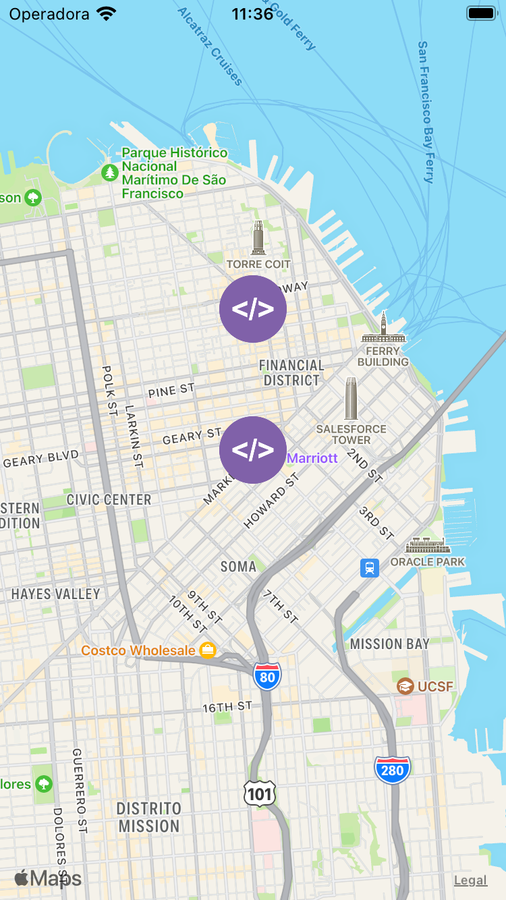
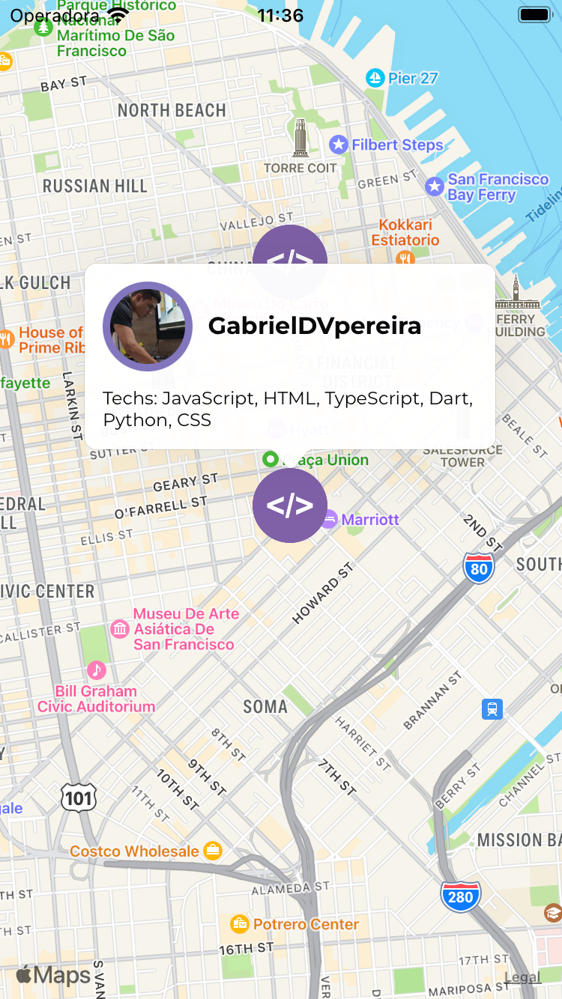

# FindDev

### Encontre incríveis desenvolvedores próximos a você. 

Esse é um aplicativo destinado para comunidade de desenvolvedores encontrar outros desenvolvedores próximos. 

 
 
 


### Requisitos

- Instalar o expo local e em seu smatphone [Expo](https://expo.dev/)
- Configurar um projeto no [firebase](https://firebase.google.com/) e obter configuraça. 

### Configucação

Adicione dentro da pasta src/Ui/src/config/ um arquivo chamado config.json com o seguinte formato: 

````
{
    "apiKey": "",
    "authDomain": "",
    "projectId": "",
    "storageBucket": "",
    "messagingSenderId": "",
    "appId": "",
    "measurementId": ""
  }
  ````
Os dados acima são obtivos após a criação de um novo projeto no Firebase. 

### Executar

Para executar o projeto, basta entrar na pasta src/Ui e executar o seguinte comando

````
  expo start 
````


